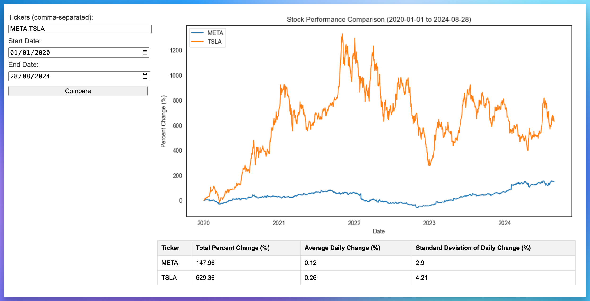

# Stock Pulse :: Stock Performance Comparison App

Compare the stock performance of multiple companies over a specified date range. 



## Features

- Fetch stock data for multiple tickers from Yahoo Finance.
- Calculate and display total percent change, average daily change, and standard deviation of daily change.
- Visualize stock performance over time using line charts.

## Requirements

- Python 3.x

## Installation

1. Clone the repository:

   ```bash
   git clone git@github.com:namuan/stock-pulse.git
   cd stock-pulse
   ```

2. Install the required packages:

   ```bash
   pip install -r requirements.txt
   ```

## Usage

### Run as Desktop application

```bash
python3 app.py
```

### Run as Web application

1. Start the Flask application:

```bash
python3 app.py --server-only
```

2. Open your web browser and go to `http://localhost:5010`.

3. Enter the stock tickers, start date, and end date to compare stock performance.

## License

This project is licensed under the MIT License. See the LICENSE file for details.
